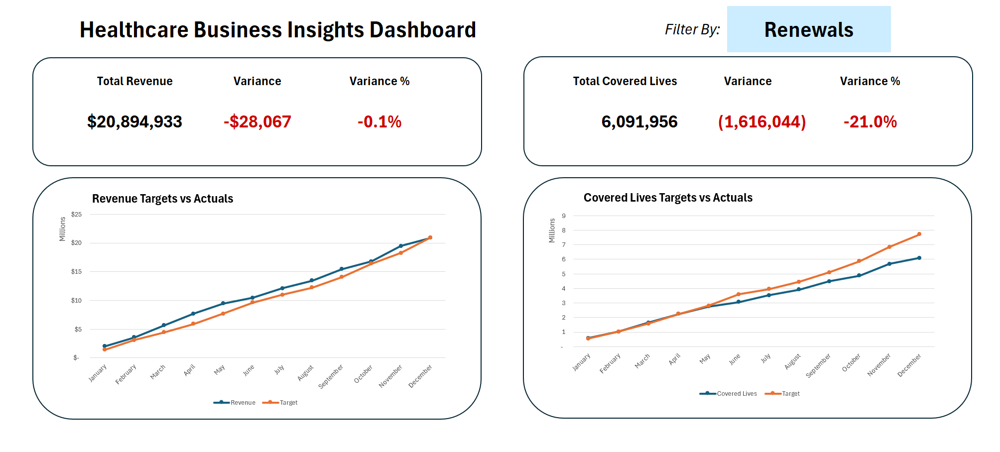

# 🏥 Healthcare Business Insights Dashboard – Excel Project  

## 📘 Project Overview  
This project analyzes the **business performance of a healthcare company** by comparing **actuals vs. yearly targets** for both **Revenue** and **Covered Lives**.  

The goal was to create an **interactive Excel dashboard** that helps management quickly visualize monthly performance, variances, and overall progress toward annual goals.  

---

## 🎯 Business Problem  
Management wanted to evaluate how well the company performed against yearly targets in terms of:  
- **Revenue** generated (New Bookings and Renewals)  
- **Covered Lives** (number of insured or active members)  

They needed a quick dashboard that reveals both **achievements and gaps** across the year.  

---

## 🧠 Objectives  
- Build rolling totals for monthly **Revenue** and **Covered Lives**  
- Calculate **Variance** and **Variance %** between Actuals and Targets  
- Create an **interactive dropdown filter** to view data by:  
  - Total  
  - New Bookings  
  - Renewals  
- Design clear **KPI cards** and **trend line charts** to highlight insights  

---

## ⚙️ Tools & Skills Used  
- **Microsoft Excel**  
  - Data Cleaning & Preparation  
  - IF Statements, Rolling Totals, Variance Formulas  
  - Data Validation (Dropdown Filters)  
  - Conditional Formatting for Variance KPIs  
  - Chart Design & Dashboard Visualization  

---

## 🧩 Project Workflow  

| Step | Description |
|------|--------------|
| **1. Data Import** | Collected raw monthly sales and target data (Revenue & Covered Lives) |
| **2. Data Processing** | Calculated rolling totals, variance, and variance % |
| **3. Interactive Controls** | Added dropdown to toggle between Total, New Bookings, and Renewals |
| **4. KPI Cards** | Displayed totals, variance, and performance % for the year |
| **5. Dashboard Visualization** | Designed an interactive dashboard combining KPIs and line charts |

---

## 📊 Key Insights  
- The company achieved **~92% of its annual revenue target** and **~88% of its covered lives target**.  
- **Renewals** were the major contributor to total revenue, showing strong retention.  
- Variance analysis highlighted months with underperformance, guiding strategic improvement.  

---

## 🚀 Learnings  
- Created **interactive dashboards** using Excel formulas and data validation.  
- Strengthened understanding of **variance analysis** and **KPI visualization**.  
- Improved dashboard storytelling to communicate insights clearly and professionally.   

---

## 🖼️ Dashboard Preview   
  

---

## 📁 Project Files  
- `Healthcare_Business_Insights_Dashboard.xlsx` – Final Excel dashboard  
- `/data/Healthcare_Sales_Raw_Data.xlsx` – Original dataset used for analysis   

---

## 🏷️ Tags  
#ExcelDashboard #HealthcareAnalytics #DataVisualization #BusinessInsights #DataAnalysis   
